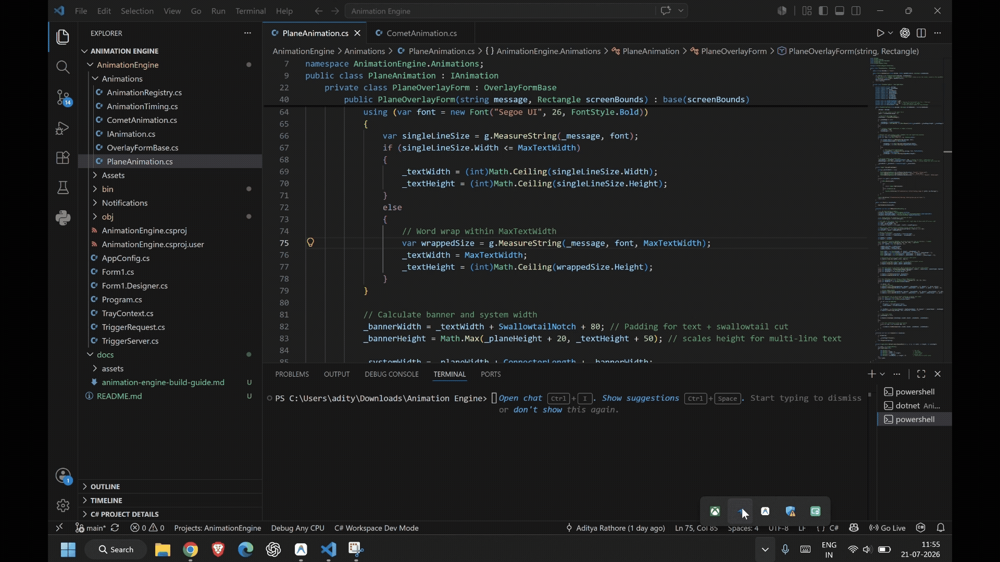

# Animation Engine


[](LICENSE)

**Animation Engine** displays fun, smooth screen overlays — like a plane trailing a banner or a glowing comet streak — to show reminders without stealing window focus.

Under the hood, it is a lightweight C# .NET 8 Windows system tray app that renders GDI+ animations triggered locally via a simple HTTP API.

---

## 🌟 Visual Preview

### ✈️ Plane Animation


### ☄️ Comet Animation


---


- **Near-Zero Footprint:** Silent Windows system tray resident using `NotifyIcon` with minimal memory/CPU usage when idle.
- **Non-Intrusive Overlays:** Click-through, topmost GDI+ rendered overlays that never steal window focus or block user interactions.
- **Local HTTP Trigger Endpoint:** Embedded `System.Net.HttpListener` server listening locally (`127.0.0.1:5057`) for instant decoupled execution from any script, `curl`, or application.
- **Extensible Animation Engine:** Pluggable `IAnimation` architecture allowing new animation styles to be added cleanly without altering server or tray logic.
- **Toast Notifications Integration:** Persists messages in the native Windows Action Center after visual overlays complete.

---

## 🚀 Getting Started

### Prerequisites

- **OS:** Windows 10 / 11 (x64)
- **SDK / Runtime:** [.NET 8.0 SDK](https://dotnet.microsoft.com/download/dotnet/8.0) (`net8.0-windows`)

### Installation & Execution

1. **Clone the Repository:**
   ```bash
   git clone https://github.com/aditya-rathore04/Animation-engine.git
   cd Animation-engine/AnimationEngine
   ```

2. **Build and Run:**
   ```bash
   dotnet run
   ```
   *The application will start silently in your Windows System Tray.*

---

## 💻 Usage & API Contract

Trigger animations by making HTTP `POST` requests to the local server.

### Trigger Endpoint

```
POST http://127.0.0.1:5057/trigger
Content-Type: application/json
```

#### Request Payload Schema

```json
{
  "message": "Meeting in 5 minutes!",
  "style": "plane",
  "speed": "normal"
}
```

| Field | Type | Required | Description / Allowed Values | Default |
| :--- | :--- | :--- | :--- | :--- |
| `message` | `string` | **Yes** | Text displayed on the animation banner and toast notification. | — |
| `style` | `string` | No | `"plane"`, `"comet"` (or custom registered animations). | `"plane"` |
| `speed` | `string` | No | `"slow"`, `"normal"`, `"fast"`. | `"normal"` |

### Quick Examples

#### cURL (Command Line / Terminal)
```bash
curl -X POST http://127.0.0.1:5057/trigger \
  -H "Content-Type: application/json" \
  -d "{\"message\": \"Focus time started!\", \"style\": \"plane\", \"speed\": \"fast\"}"
```

#### Health Check
```bash
curl http://127.0.0.1:5057/ping
# Output: ok
```

#### C# Integration Example
```csharp
using System.Net.Http;
using System.Text;
using System.Text.Json;

var client = new HttpClient();
var payload = new
{
    message = "Hydration Break!",
    style = "comet",
    speed = "normal"
};

var content = new StringContent(JsonSerializer.Serialize(payload), Encoding.UTF8, "application.json");
var response = await client.PostAsync("http://127.0.0.1:5057/trigger", content);
```

---

## 🛠️ Architecture & Build Guide

For detailed architecture breakdown, implementation specifications, and guidelines on adding custom animation extensions, refer to the [Agent Build Guide](docs/animation-engine-build-guide.md).

---

## 📄 License

This project is licensed under the [MIT License](LICENSE).
